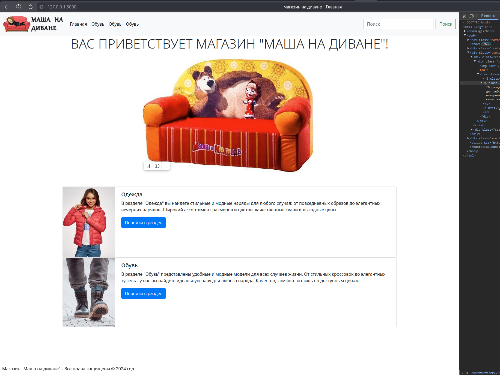
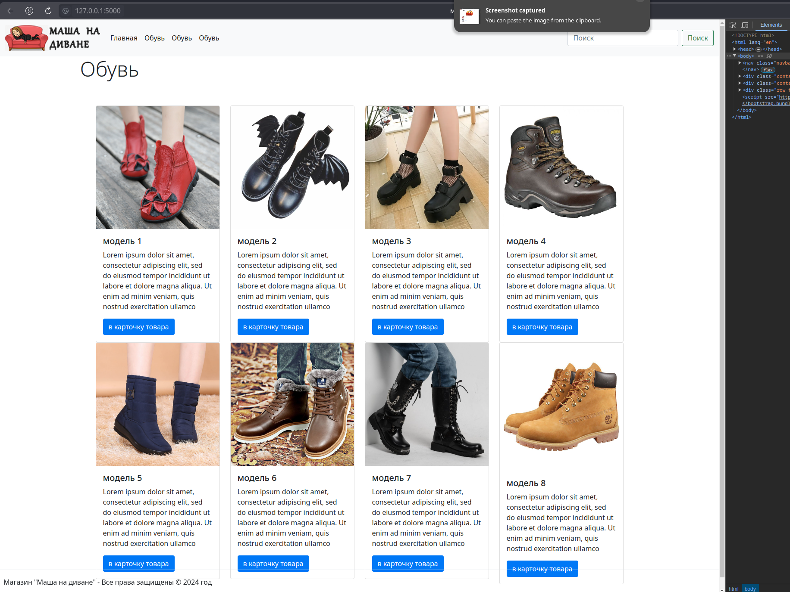
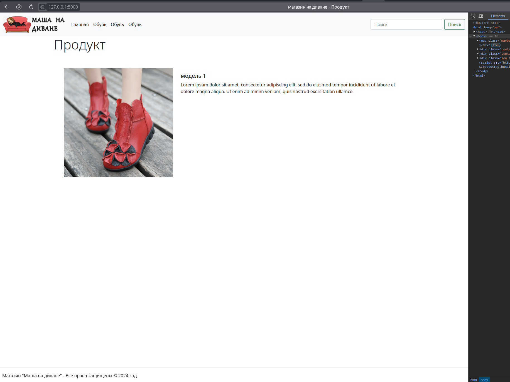

# Geek Brains. Домашнее задание
## Фреймворки Flask и FastAPI (семинары) - Урок 1. Знакомство с Flask

### Задание.
Создать базовый шаблон для интернет-магазина, содержащий общие элементы дизайна (шапка, меню, подвал), и дочерние шаблоны для страниц категорий товаров и отдельных товаров. Например, создать страницы «Одежда», «Обувь» и «Куртка», используя базовый шаблон.

### Решение

Скриншоты домашней работы

Главная:

Страница категории товаров:

Карточка товара:
